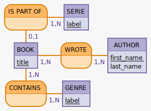

# API for Brandon SANDERSON's books

Little project to gather info on all of Brandon SANDERSON'S books.
This API shall follow the [REST architecture](https://practicalprogramming.fr/api-rest) (link in French).

## MCD/MLD

The [MCD](./conception/mcd.md) and [MLD](./conception/mld.md) have been done thanks to [mocodo](http://mocodo.wingi.net/).


## Sources

Take as much info as possible on the books and author on [Brandon SANDERSON's wikipedia page](https://en.wikipedia.org/wiki/Brandon_Sanderson), his [website](https://www.brandonsanderson.com/) and this [wiki](https://coppermind.net/wiki/Coppermind:Welcome) made by fans.


## Stack used

### Server-side

#### Node.js / Express and their friends

The frameworks [__Node.js__](https://nodejs.org/en/download) (v12 or above) and [__Express__](https://www.npmjs.com/package/express) will be used in order to set up the server of the API.

[__Dotenv__](https://www.npmjs.com/package/dotenv) will be needed in order to have environment variables interact with the application.

[__PG__](https://www.npmjs.com/package/pg) will be needed as well in order to help our application interact with PSQL (see section below).

It is likely that authentification will be needed. Therefore [__express-session__](https://www.npmjs.com/package/express-session) and [__joi__](https://www.npmjs.com/package/joi) (to validate the updated or added data) might be installed in the future (*TBC*).

#### PSQL & Data Mapper

The database management system (DBMS) used is [PSQL](https://www.postgresql.org/docs/13/app-psql.html).
The magic link between the database and the application will be a hand-made Data Mapper along with PG.

A dedicated user and database are created thanks to PSQL command lines.


### Client-side

#### Vanilla JS or Vue.js or some exotic JS framework?

To be determined. Let's make the API work first. We'll make it pretty afterwards.

## Installation

First, clone the repository:
```bash
git clone git@github.com:Dananando/17th-shard-API.git
```

Then install the relevant dependancies:
```bash
nmp install
```

Create the .env and sqitch.conf files thanks to the .example files. Then create a PSQL DataBase and deploy the sqitch project.

```bash
createdb boardgame
sqitch deploy db:pg:brandon-api
```

Configure PSQL (or supply the relevant environment variables) so that the createdb and sqitch commands can be executed correctly.

## Test the API - Import some data

In order to set up a few test datas, use the following command :

```bash
psql -d boardgame -f ./data/import_data.sql
```
## Launch the project

```bash
npm start
```